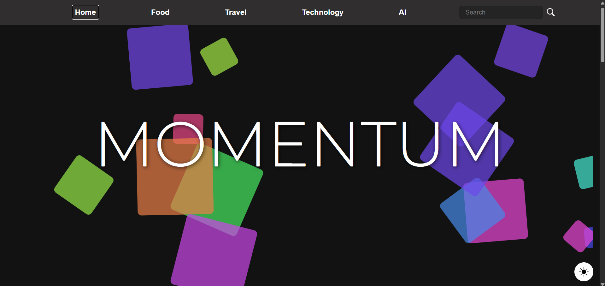
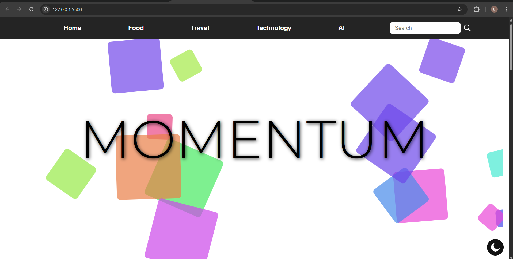
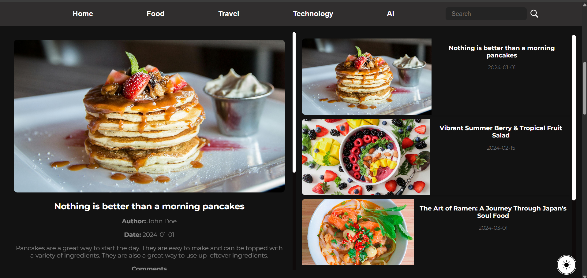
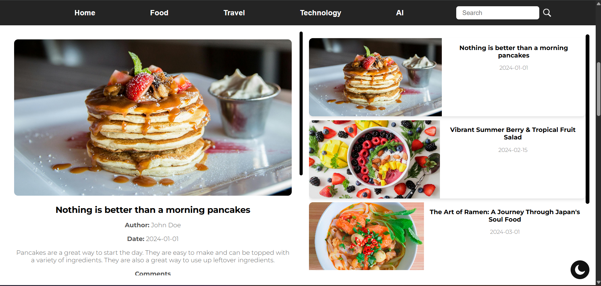

# Blog Website

A responsive and interactive blog website showcasing articles across various categories such as Food, Travel, Technology, and AI. The website features a modern design, smooth navigation, and a theme toggle for light and dark modes.

## Features

### 1. **Responsive Design**

- The website is fully responsive and adapts to different screen sizes, ensuring a seamless experience on both desktop and mobile devices.

### 2. **Theme Toggle**

- Users can switch between light and dark themes using the theme toggle button. The selected theme is saved in `localStorage` and persists across sessions.

### 3. **Category-Based Blogs**

- Blogs are categorized into:
  - Food
  - Travel
  - Technology
  - AI
- Each category has a dedicated section displaying a slider of blog cards and a detailed view of the selected blog.

### 4. **Interactive Blog Cards**

- Blog cards display a preview of the blog, including the title and date.
- Clicking on a blog card opens the detailed view of the blog, showing the full description, author, date, and comments.

### 5. **Comment System**

- Users can add comments to blogs by filling out a form with their name, email, and comment text.
- Comments are displayed below the blog details.

### 6. **Smooth Scrolling**

- Navigation buttons enable smooth scrolling to different sections of the website.

### 7. **Dynamic Background**

- The home section features a dynamic background with animated boxes for a visually appealing effect.

### 8. **Mobile Navigation**

- A mobile-friendly navigation menu allows users to easily access different sections of the website.

## File Structure

```
Blog_Website/ ├── assets/ # Contains images for blogs and icons │ ├── moon.png # Icon for light theme │ ├── sun.png # Icon for dark theme │ ├── search-dark.png # Search icon for dark theme │ ├── search-light.png # Search icon for light theme │ ├── ai/ # AI blog images │ ├── food/ # Food blog images │ ├── tech/ # Technology blog images │ └── travel/ # Travel blog images ├── data.js # Contains blog data ├── index.html # Main HTML file ├── script.js # JavaScript for interactivity ├── style.css # CSS for styling └── README.md # Project documentation
```

## Technologies Used

- **HTML5**: For structuring the content.
- **CSS3**: For styling and responsive design.
- **JavaScript (ES6)**: For interactivity and dynamic content rendering.

## How to Run the Project

1. Clone the repository or download the project files.
2. Open the `index.html` file in any modern web browser.
3. Explore the website and its features.

## Blog Data Structure

The blog data is stored in `data.js` as an object with categories (`food`, `tech`, `ai`, `travel`). Each category contains an array of blog objects with the following properties:

- `id`: Unique identifier for the blog.
- `image_url`: Path to the blog's image.
- `title`: Title of the blog.
- `description`: Detailed description of the blog.
- `author`: Author of the blog.
- `date`: Publication date.
- `selected`: Boolean indicating if the blog is the featured one for the category.
- `comments`: Array of comment objects, each containing:
  - `author`: Name of the commenter.
  - `email`: Email of the commenter.
  - `date`: Date of the comment.
  - `text`: Comment text.

## Features in Detail

### Theme Toggle

- The theme toggle button switches between light and dark themes.
- The theme state is saved in `localStorage` to persist across sessions.

### Blog Slider

- Each category has a slider displaying all blogs in that category.
- Clicking on a blog card renders the detailed view of the blog.

### Comment System

- Users can add comments to blogs.
- Comments are dynamically rendered and stored in memory.

### Navigation

- Smooth scrolling is implemented for navigation buttons to scroll to specific sections.

## Screenshots

### Home Section




### Blog Section




## Future Enhancements

- Add a backend to store blog data and comments persistently.
- Implement a search feature to filter blogs by title or content.
- Add user authentication for personalized experiences.

## Author

- **Reuel Bodhak**: Developer and designer of the Blog Website.
